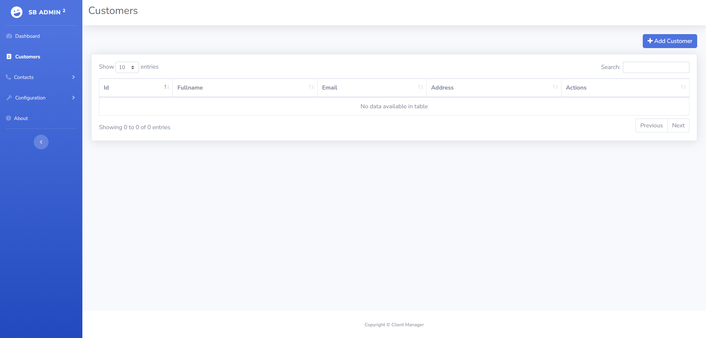
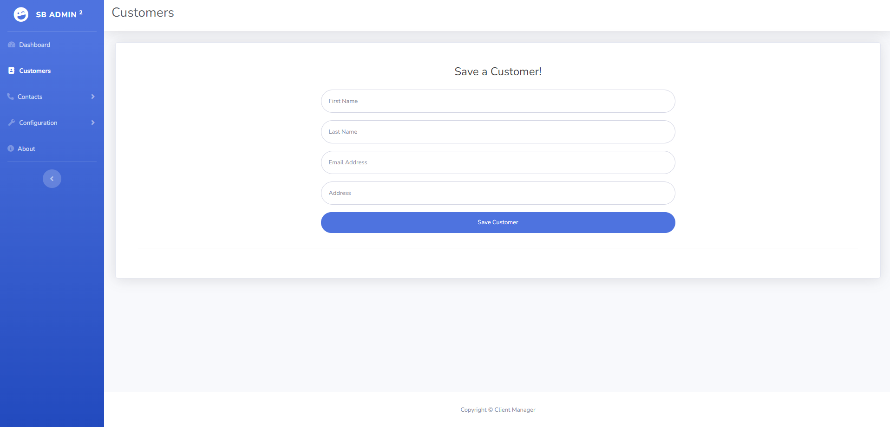

# Gestión de Clientes con Spring Boot

Este proyecto es una herramienta web desarrollada con **Spring Boot** para la gestión de clientes. En el front-end, se utiliza la plantilla **SB Admin 2**, que puedes encontrar [aquí](https://startbootstrap.com/theme/sb-admin-2).

# Imagenes del proyecto

## Funcionalidades Principales

- **Obtener todos los clientes:** `GET /api/customers`
- **Obtener un cliente específico:** `GET /api/customer/{id}`
- **Registrar un nuevo cliente:** `POST /api/customer`
- **Eliminar un cliente específico:** `DELETE /api/customer/{id}`
- **Modificar un cliente específico:** `PUT /api/customer/{id}`
- **Buscar clientes por email o dirección:** `GET /api/customer/search?email={email}&address={address}`
